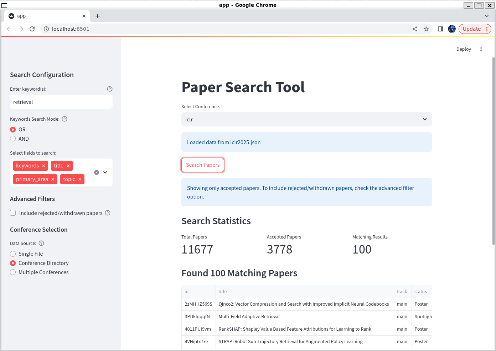

# Paper Lists

This repository powers [Paper Copilot](https://papercopilot.com), combining data from multiple sources to ensure coherence, consistency, and comprehensiveness.

Typically, records from OpenReview, official conference sources, or open access sites are scattered, leading to fragmented information and extra effort to navigate between them. The aim of this repository is to serve as a comprehensive link collection for major conferences, enabling easier access to relevant information, and statistical analysis will be based on these records.

## Local Search Tool
We further provide a streamlit-based tool for efficiently searching and analyzing conference papers locally. Thanks to @hhh2210's contribution. 

### Setup
```bash
# Clone the repo and install dependencies
git clone https://github.com/papercopilot/paperlists.git
# use conda if needed: conda create -n papercopilot python=3.10
pip install -r requirements.txt
```

### Usage
#### 1. Web Interface
```bash
cd paperlists/tools
streamlit run app.py
# a corresponding local url will popsup, e.g. `Local URL: http://localhost:8501`
```


#### 2. Command Line Usage
```bash
cd paperlists/tools
python extract.py [keyword] [-i INPUT_PATH] [-o OUTPUT_FILE] [-f FIELDS...]
```

- `keyword`: Search keyword (required)
- `-i, --input_path`: Input JSON file or directory (default: iclr2025.json)
- `-o, --output_file`: Output JSON file (optional)
- `-f, --fields`: Fields to search (default: keywords title primary_area topic)

Example:
```bash
cd paperlists/tools
python extract.py retrieval -i iclr/iclr2025.json -o results.json -f title keywords
``` 

## Overview
### [ICLR](https://papercopilot.com/statistics/iclr-statistics/)
| Year | 2025 | 2024 | 2023 | 2022 | 2021 | 2020 |
|:-:|:-:|:-:|:-:|:-:|:-:|:-:|
| json | [2025](https://raw.githubusercontent.com/Papercopilot/paperlists/main/iclr/iclr2025.json) | [2024](https://raw.githubusercontent.com/Papercopilot/paperlists/main/iclr/iclr2024.json) | [2023](https://raw.githubusercontent.com/Papercopilot/paperlists/main/iclr/iclr2023.json) | [2022](https://raw.githubusercontent.com/Papercopilot/paperlists/main/iclr/iclr2022.json) | [2021](https://raw.githubusercontent.com/Papercopilot/paperlists/main/iclr/iclr2021.json) | [2020](https://raw.githubusercontent.com/Papercopilot/paperlists/main/iclr/iclr2020.json) |
| Statistics (Main) | [2025](https://papercopilot.com/statistics/iclr-statistics/iclr-2025-statistics/) | [2024](https://papercopilot.com/statistics/iclr-statistics/iclr-2024-statistics/) | [2023](https://papercopilot.com/statistics/iclr-statistics/iclr-2023-statistics/) | [2022](https://papercopilot.com/statistics/iclr-statistics/iclr-2022-statistics/) | [2021](https://papercopilot.com/statistics/iclr-statistics/iclr-2021-statistics/) | [2020](https://papercopilot.com/statistics/iclr-statistics/iclr-2020-statistics/) |

| Year | 2019 | 2018 | 2017 | 2016 | 2015 | 2014 | 2013 |
|:-:|:-:|:-:|:-:|:-:|:-:|:-:|:-:|
| json | [2019](https://raw.githubusercontent.com/Papercopilot/paperlists/main/iclr/iclr2019.json) | [2018](https://raw.githubusercontent.com/Papercopilot/paperlists/main/iclr/iclr2018.json) | [2017](https://raw.githubusercontent.com/Papercopilot/paperlists/main/iclr/iclr2017.json) | | | [2014](https://raw.githubusercontent.com/Papercopilot/paperlists/main/iclr/iclr2014.json) | [2013](https://raw.githubusercontent.com/Papercopilot/paperlists/main/iclr/iclr2013.json) | 
| Statistics (Main) | [2019](https://papercopilot.com/statistics/iclr-statistics/iclr-2019-statistics/) | [2018](https://papercopilot.com/statistics/iclr-statistics/iclr-2018-statistics/) | [2017](https://papercopilot.com/statistics/iclr-statistics/iclr-2017-statistics/) | | | [2014](https://papercopilot.com/statistics/iclr-statistics/iclr-2014-statistics/) | [2013](https://papercopilot.com/statistics/iclr-statistics/iclr-2013-statistics/) | 

### [NeurIPS(NIPS)](https://papercopilot.com/statistics/neurips-statistics/)
| Year | 2024 | 2023 | 2022 | 2021 | 2020 |
|:-:|:-:|:-:|:-:|:-:|:-:|
| json | [2024](https://raw.githubusercontent.com/Papercopilot/paperlists/main/nips/nips2024.json) | [2023](https://raw.githubusercontent.com/Papercopilot/paperlists/main/nips/nips2023.json) | [2022](https://raw.githubusercontent.com/Papercopilot/paperlists/main/nips/nips2022.json) | [2021](https://raw.githubusercontent.com/Papercopilot/paperlists/main/nips/nips2021.json) | [2020](https://raw.githubusercontent.com/Papercopilot/paperlists/main/nips/nips2020.json) |
| Statistics (Main) | [2024](https://papercopilot.com/statistics/neurips-statistics/neurips-2024-statistics/) | [2023](https://papercopilot.com/statistics/neurips-statistics/neurips-2023-statistics/) | [2022](https://papercopilot.com/statistics/neurips-statistics/neurips-2022-statistics/) | [2021](https://papercopilot.com/statistics/neurips-statistics/neurips-2021-statistics/) | |
| Statistics (Datasets & Benchmarks) | [2024](https://papercopilot.com/statistics/neurips-statistics/neurips-2024-statistics-datasets-benchmarks/) |[2023](https://papercopilot.com/statistics/neurips-statistics/neurips-2023-statistics-datasets-benchmarks/) | [2022](https://papercopilot.com/statistics/neurips-statistics/neurips-2022-statistics-datasets-benchmarks/) | | |

| Year | 2019 | 2018 | 2017 | 2016 | 2015 | 2014 | 2013 | 2012 | 2011 | 2010 | 
|:-:|:-:|:-:|:-:|:-:|:-:|:-:|:-:|:-:|:-:|:-:|
| json | [2019](https://raw.githubusercontent.com/Papercopilot/paperlists/main/nips/nips2019.json) | [2018](https://raw.githubusercontent.com/Papercopilot/paperlists/main/nips/nips2018.json) | [2017](https://raw.githubusercontent.com/Papercopilot/paperlists/main/nips/nips2017.json) | [2016](https://raw.githubusercontent.com/Papercopilot/paperlists/main/nips/nips2016.json) | [2015](https://raw.githubusercontent.com/Papercopilot/paperlists/main/nips/nips2015.json) | [2014](https://raw.githubusercontent.com/Papercopilot/paperlists/main/nips/nips2014.json) | [2013](https://raw.githubusercontent.com/Papercopilot/paperlists/main/nips/nips2013.json) | [2012](https://raw.githubusercontent.com/Papercopilot/paperlists/main/nips/nips2012.json) | [2011](https://raw.githubusercontent.com/Papercopilot/paperlists/main/nips/nips2011.json) | [2010](https://raw.githubusercontent.com/Papercopilot/paperlists/main/nips/nips2010.json) |

| Year | 2009 | 2008 | 2007 | 2006 | 2005 | 2004 | 2003 | 2002 | 2001 | 2000 | 
|:-:|:-:|:-:|:-:|:-:|:-:|:-:|:-:|:-:|:-:|:-:|
| json | [2009](https://raw.githubusercontent.com/Papercopilot/paperlists/main/nips/nips2009.json) | [2008](https://raw.githubusercontent.com/Papercopilot/paperlists/main/nips/nips2008.json) | [2007](https://raw.githubusercontent.com/Papercopilot/paperlists/main/nips/nips2007.json) | [2006](https://raw.githubusercontent.com/Papercopilot/paperlists/main/nips/nips2006.json) | [2005](https://raw.githubusercontent.com/Papercopilot/paperlists/main/nips/nips2005.json) | [2004](https://raw.githubusercontent.com/Papercopilot/paperlists/main/nips/nips2004.json) | [2003](https://raw.githubusercontent.com/Papercopilot/paperlists/main/nips/nips2003.json) | [2002](https://raw.githubusercontent.com/Papercopilot/paperlists/main/nips/nips2002.json) | [2001](https://raw.githubusercontent.com/Papercopilot/paperlists/main/nips/nips2001.json) | [2000](https://raw.githubusercontent.com/Papercopilot/paperlists/main/nips/nips2000.json) |

### [ICML](https://papercopilot.com/statistics/icml-statistics/)
| Year | 2024  | 2023 | 2022 | 2021 | 2020 | 2019 | 2018 | 2017 |
|:-:|:-:|:-:|:-:|:-:|:-:|:-:|:-:|:-:|
| json | [2024](https://raw.githubusercontent.com/Papercopilot/paperlists/main/icml/icml2024.json) | [2023](https://raw.githubusercontent.com/Papercopilot/paperlists/main/icml/icml2023.json) | [2022](https://raw.githubusercontent.com/Papercopilot/paperlists/main/icml/icml2022.json) | [2021](https://raw.githubusercontent.com/Papercopilot/paperlists/main/icml/icml2021.json) | [2020](https://raw.githubusercontent.com/Papercopilot/paperlists/main/icml/icml2020.json) | [2019](https://raw.githubusercontent.com/Papercopilot/paperlists/main/icml/icml2019.json) | [2018](https://raw.githubusercontent.com/Papercopilot/paperlists/main/icml/icml2018.json) | [2017](https://raw.githubusercontent.com/Papercopilot/paperlists/main/icml/icml2017.json) |

### [SIGGRAPH](https://papercopilot.com/statistics/siggraph-statistics/)
| Year | 2024 | 2023 | 2022 | 2021 | 2020 |
|:-:|:-:|:-:|:-:|:-:|:-:|
| json | [2024](https://raw.githubusercontent.com/Papercopilot/paperlists/main/siggraph/siggraph2024.json) |[2023](https://raw.githubusercontent.com/Papercopilot/paperlists/main/siggraph/siggraph2023.json) | [2022](https://raw.githubusercontent.com/Papercopilot/paperlists/main/siggraph/siggraph2022.json) | [2021](https://raw.githubusercontent.com/Papercopilot/paperlists/main/siggraph/siggraph2021.json) | [2020](https://raw.githubusercontent.com/Papercopilot/paperlists/main/siggraph/siggraph2020.json) |
| Paperlist | [2024](https://papercopilot.com/paper-list/siggraph-paper-list/siggraph-2024-paper-list/) | [2023](https://papercopilot.com/paper-list/siggraph-paper-list/siggraph-2023-paper-list/) | [2022](https://papercopilot.com/paper-list/siggraph-paper-list/siggraph-2022-paper-list/) | [2021](https://papercopilot.com/paper-list/siggraph-paper-list/siggraph-2021-paper-list/) | [2020](https://papercopilot.com/paper-list/siggraph-paper-list/siggraph-2020-paper-list/) |

| Year | 2019 | 2018 | 2017 | 2016 | 2015 | 2014 | 2013 | 2012 | 2011 | 2010 | 
|:-:|:-:|:-:|:-:|:-:|:-:|:-:|:-:|:-:|:-:|:-:|
| json | [2019](https://raw.githubusercontent.com/Papercopilot/paperlists/main/siggraph/siggraph2019.json) | [2018](https://raw.githubusercontent.com/Papercopilot/paperlists/main/siggraph/siggraph2018.json) | [2017](https://raw.githubusercontent.com/Papercopilot/paperlists/main/siggraph/siggraph2017.json) | [2016](https://raw.githubusercontent.com/Papercopilot/paperlists/main/siggraph/siggraph2016.json) | [2015](https://raw.githubusercontent.com/Papercopilot/paperlists/main/siggraph/siggraph2015.json) | [2014](https://raw.githubusercontent.com/Papercopilot/paperlists/main/siggraph/siggraph2014.json) | [2013](https://raw.githubusercontent.com/Papercopilot/paperlists/main/siggraph/siggraph2013.json) | [2012](https://raw.githubusercontent.com/Papercopilot/paperlists/main/siggraph/siggraph2012.json) | [2011](https://raw.githubusercontent.com/Papercopilot/paperlists/main/siggraph/siggraph2011.json) | [2010](https://raw.githubusercontent.com/Papercopilot/paperlists/main/siggraph/siggraph2010.json) |
| Paperlist | [2019](https://papercopilot.com/paper-list/siggraph-paper-list/siggraph-2019-paper-list/) | [2018](https://papercopilot.com/paper-list/siggraph-paper-list/siggraph-2018-paper-list/) | [2017](https://papercopilot.com/paper-list/siggraph-paper-list/siggraph-2017-paper-list/) | [2016](https://papercopilot.com/paper-list/siggraph-paper-list/siggraph-2016-paper-list/) | [2015](https://papercopilot.com/paper-list/siggraph-paper-list/siggraph-2015-paper-list/) | [2014](https://papercopilot.com/paper-list/siggraph-paper-list/siggraph-2014-paper-list/) |[2013](https://papercopilot.com/paper-list/siggraph-paper-list/siggraph-2013-paper-list/) |[2012](https://papercopilot.com/paper-list/siggraph-paper-list/siggraph-2012-paper-list/) |[2011](https://papercopilot.com/paper-list/siggraph-paper-list/siggraph-2011-paper-list/) |[2010](https://papercopilot.com/paper-list/siggraph-paper-list/siggraph-2010-paper-list/) |

### [SIGGRAPH Asia](https://papercopilot.com/statistics/siggraph-asia-statistics/)
| Year | 2024 | 2023 | 2022 | 2021 | 2020 | 2019 | 2018 |
|:-:|:-:|:-:|:-:|:-:|:-:|:-:|:-:|
| json | [2024](https://raw.githubusercontent.com/Papercopilot/paperlists/main/siggraphasia/siggraphasia2024.json) | [2023](https://raw.githubusercontent.com/Papercopilot/paperlists/main/siggraphasia/siggraphasia2023.json) | [2022](https://raw.githubusercontent.com/Papercopilot/paperlists/main/siggraphasia/siggraphasia2022.json) | [2021](https://raw.githubusercontent.com/Papercopilot/paperlists/main/siggraphasia/siggraphasia2021.json) | [2020](https://raw.githubusercontent.com/Papercopilot/paperlists/main/siggraphasia/siggraphasia2020.json) | [2019](https://raw.githubusercontent.com/Papercopilot/paperlists/main/siggraphasia/siggraphasia2019.json) | [2018](https://raw.githubusercontent.com/Papercopilot/paperlists/main/siggraphasia/siggraphasia2018.json) |
| Paperlist | [2024](https://papercopilot.com/paper-list/siggraph-asia-paper-list/siggraph-asia-2024-paper-list/) | [2023](https://papercopilot.com/paper-list/siggraph-asia-paper-list/siggraph-asia-2023-paper-list/) | [2022](https://papercopilot.com/paper-list/siggraph-asia-paper-list/siggraph-asia-2022-paper-list/) | [2021](https://papercopilot.com/paper-list/siggraph-asia-paper-list/siggraph-asia-2021-paper-list/) | [2020](https://papercopilot.com/paper-list/siggraph-asia-paper-list/siggraph-asia-2020-paper-list/) | [2019](https://papercopilot.com/paper-list/siggraph-asia-paper-list/siggraph-asia-2019-paper-list/) | [2018](https://papercopilot.com/paper-list/siggraph-asia-paper-list/siggraph-asia-2018-paper-list/) |

### CVPR
| Year | 2024 | 2023 | 2022 | 2021 | 2020 | 2019 | 2018 | 2017 |
|:-:|:-:|:-:|:-:|:-:|:-:|:-:|:-:|:-:|
| json | [2024](https://raw.githubusercontent.com/Papercopilot/paperlists/main/cvpr/cvpr2024.json) | [2023](https://raw.githubusercontent.com/Papercopilot/paperlists/main/cvpr/cvpr2023.json) | [2022](https://raw.githubusercontent.com/Papercopilot/paperlists/main/cvpr/cvpr2022.json) | [2021](https://raw.githubusercontent.com/Papercopilot/paperlists/main/cvpr/cvpr2021.json) | [2020](https://raw.githubusercontent.com/Papercopilot/paperlists/main/cvpr/cvpr2020.json) | [2019](https://raw.githubusercontent.com/Papercopilot/paperlists/main/cvpr/cvpr2019.json) | [2018](https://raw.githubusercontent.com/Papercopilot/paperlists/main/cvpr/cvpr2018.json) | [2017](https://raw.githubusercontent.com/Papercopilot/paperlists/main/cvpr/cvpr2017.json) |

### ICCV [Coming Soon]
### ECCV [Coming Soon]

### [EMNLP](https://papercopilot.com/statistics/emnlp-statistics/)
| Year | 2024 |2023 |
|:-:|:-:|:-:|
| json | [2024](https://raw.githubusercontent.com/Papercopilot/paperlists/main/emnlp/emnlp2024.json)| [2023](https://raw.githubusercontent.com/Papercopilot/paperlists/main/emnlp/emnlp2023.json) |
| Statistics | [2024](https://papercopilot.com/statistics/emnlp-statistics/emnlp-2024-statistics/) |[2023](https://papercopilot.com/statistics/emnlp-statistics/emnlp-2023-statistics/) |

### [CoRL](https://papercopilot.com/statistics/corl-statistics/)
| Year | 2024 | 2023 | 2022 | 2021 |
|:-:|:-:|:-:|:-:|:-:|
| json | [2024](https://raw.githubusercontent.com/Papercopilot/paperlists/main/corl/corl2024.json) | [2023](https://raw.githubusercontent.com/Papercopilot/paperlists/main/corl/corl2023.json) | [2022](https://raw.githubusercontent.com/Papercopilot/paperlists/main/corl/corl2022.json) | [2021](https://raw.githubusercontent.com/Papercopilot/paperlists/main/corl/corl2021.json) |
| Statistics | [2024](https://papercopilot.com/statistics/corl-statistics/corl-2024-statistics/) | [2023](https://papercopilot.com/statistics/corl-statistics/corl-2023-statistics/) | [2022](https://papercopilot.com/statistics/corl-statistics/corl-2022-statistics/) | [2021](https://papercopilot.com/statistics/corl-statistics/corl-2021-statistics/) |

